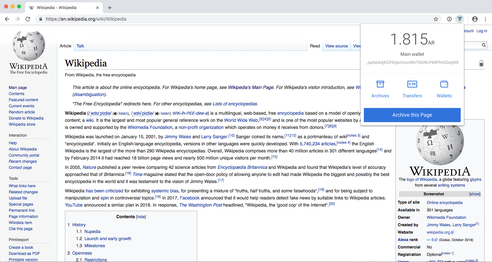
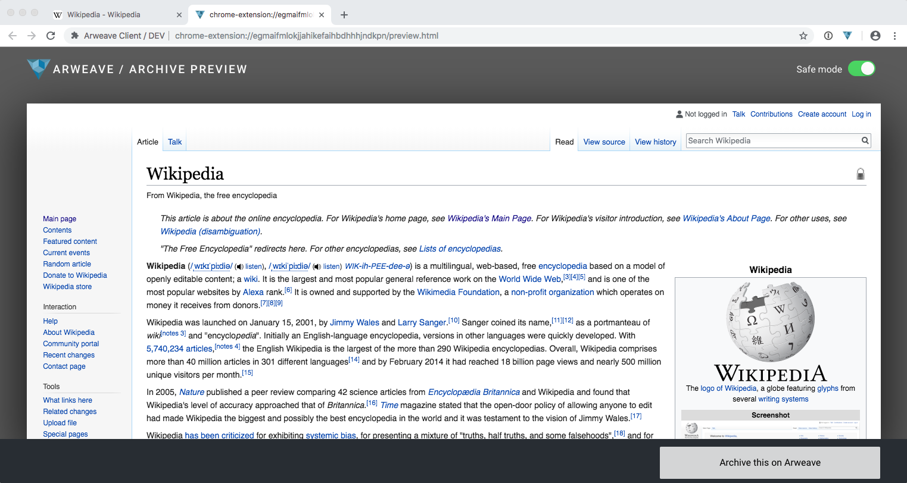
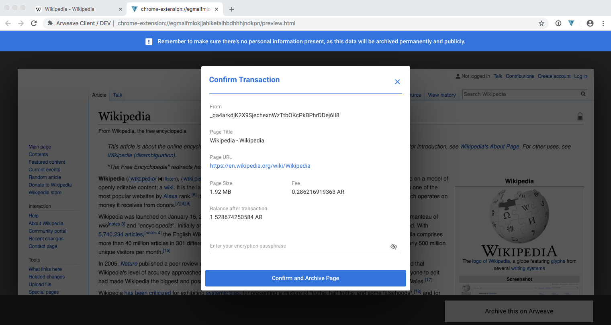

# Archiving Web Pages

  
If you're new to Arweave check out the web extension [getting started](../wallets/arweave-web-extension-wallet.md) guide, and download the [chrome extension](https://chrome.google.com/webstore/detail/arweave/iplppiggblloelhoglpmkmbinggcaaoc).

## Archiving a web page

Archiving is easy, simply browse whichever page you’d like to archive and click _Archive this Page_.

Before your page is archived, you’ll see a preview of how the page will look. You may notice some slight differences from the original page, this is for a few reasons:

1\) **Javascript is disabled** and completely stripped from the page; this is for your own safety, as running JavaScript can compromise browser security.

2\) **Assets like images and CSS will be embedded** directly in the archived page itself, instead of remaining on the original website server. This means that even if the website goes down in future, the page will still render correctly as it’s now is a self-contained package.

3\) **Safe mode is on by default.** You can read about safe mode below.

We’re continually working to make the archiving process more resilient, which means progressively reducing web pages’ reliance on outside sources to function. For example, by including CSS \(the code that styles web pages\) within archived pages, we are ensuring that pages always display correctly even if the CSS outside of the archived page is altered.

Once you’re happy with the preview, click _Archive this on Arweave_ review the information and price, enter your wallet encryption passphrase, then hit confirm.

It should only take a few seconds to submit your transaction to the network, however this depends on a few factors such as the current network state, your internet connection speed, and the size of the page you’re archiving. Once you’re done, you’ll see the screen that says ‘Transaction sent — This should be mined into a block soon.’

## Safe Mode

**What is it?**

Many websites employ various means of customising content for users by tracking their online activity — ever noticed after browsing those pair of shoes how many spooky ads follow you around the web?! Yup, this is what we’re talking about!

This means that when you archive a page from a browser which contains personal information \(e.g. you’re logged into Google Suite, Amazon, Facebook\), you may also end up archiving tiny artifacts about yourself, such as your browsing habits. Because some of these artifacts are subtle and are often hidden or embedded within the source code, it’s important to make sure you protect your information by archiving in safe mode.

Here’s an example: Imagine you’re logged into amazon.co.uk and information such as your name, postal code, account age, number of items in basket, and recent Prime Video streams are on display, as seen in the screenshot below.

During safe mode, all of your personal information becomes invisible — as you can see in the screenshot below.

During safe mode, all of your personal information becomes invisible — as you can see in the screenshot below.

**How does it work?**

Safe mode works similar to ‘Incognito Mode’ which you may be familiar with from using the Google Chrome browser. When archiving in safe mode a fresh request copy of the URL is made without any cookies, meaning your archive only exposes the minimum amount of information possible about your browser session.

Here’s a redacted view of the HTTP headers sent on the original amazon.co.uk request — you can see it sends a bunch of tracking information about your session.

With safe mode turned on, we only send the minimum amount of information required to render the page. The cookie and session data is now gone, and this is a much safer way to archive pages.

**Why is this the default?**

Safe mode is turned on by default to prevent the accidental archiving of personal or sensitive information. Imagine you open your bank account and click archive — during safe mode you’ll only see the login page of your bank, but should you turn safe mode off, you’ll see all of your account details/activity. We feel that safe mode is the safest way to enable quick archiving from your browser.

**What about paywalls or other “gated” content? How do I turn it off?**

Some content may only be visible if you’re logged in \(like newspapers that use paywalls\). With safe mode turned on, you might not be able to archive these pages and after all, the point of safe mode is to mask your identity so the website you’re visiting doesn’t know if you’re logged in or not!

You can toggle safe mode on and off by clicking the _Safe Mode_ switch on the preview page. When you turn safe mode off, the preview will switch to the content pulled directly from the tab you archived.

